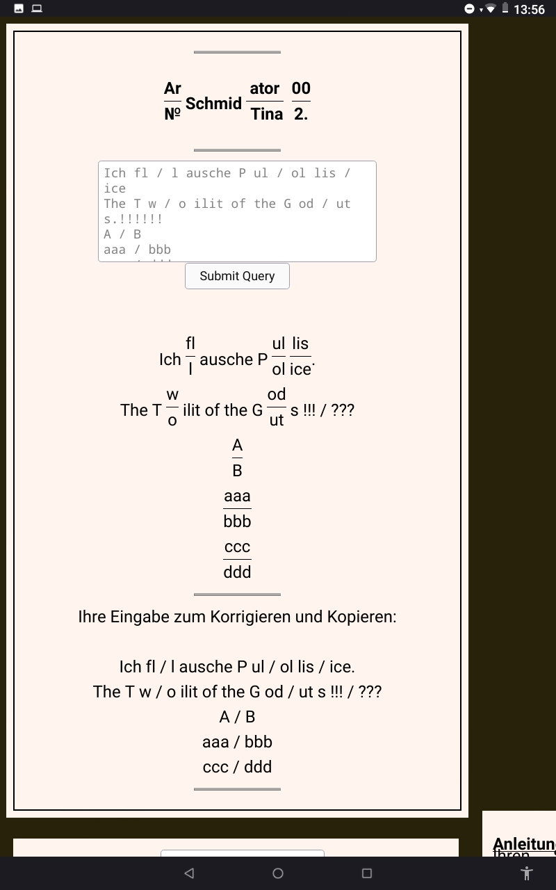

# schmidtinator
## a literaric inspirative nonsense gimmick
An­lei­tung : Ge­ben Sie Ihr­en Schmidt­etym­bruch zu ein­em bis drei Zei­chen, mit Leer­zei­chen ab­ge­setzt, ge­tren­nt mit ei­nem
```
"	 /  	"
"	 aa 	 /  	 bbb  	"
```

, die­sen mit Leer­zei­chen ( Pau­sen ) { Spa­ce , gro­ße lä ng­ste Tast­e } um­schlos­sen, ein. Kon­trol­lieren Sie das Er­geb­nis. Sie kön­nen den html out­put e­di­tie­ren und noch mal ein­fü­gen, dann kom­men Sie zu höh­er­en Le­vels. Z.B. aus ei­nem
```

<sub>v</sub>
```
mach­en sie
```

<sub> v / f </sub>
```

. Um­lau­te und sz wer­den of­fen­sicht­lich als zwei Zei­chen in­ter­pre­tiert. Län­ge­re Aus­drük­ke in ( Drei­er- ) grup­pen um­wan­deln:

Z.B. 3 + 3 + 2.

Sonst­ige Zahl­en oder Zeich­en sind nicht zu­ge­las­sen. Das Pro­gramm be­nutzt Reg­ex und css. Der Re­gex­aus­druck kön­nte um wei­te­re Zeich­en er­gänzt wer­den. Wir schrei­ben die Ein­ga­be mit (hier). Vorsicht: Suchtgefahr.



## Installation

Put schmidtinatorfunktioniertregex2.php and deepspace.php and style.css in your root folder with PHP support.
If it do not work uncomment css style in schm...ex2.php or put and try with style.php.
Root folder as long as my links point ../style.css instead style.css.


## To Do

* Some radiobuttons for different regex patterns, or additional charakters, Numbers. Or stringlenth.
* Correct this silly onclick="this.value=''" to run only once.
* Bottoms Dream stylish exportin three columns.
* Texteditor incorporate.
* Some basic security, trim, substring wordwrap and filsize limitation
* try Post method
* Translate Anleitung usage. 
* B/W style
